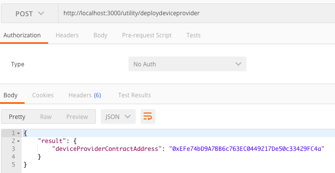
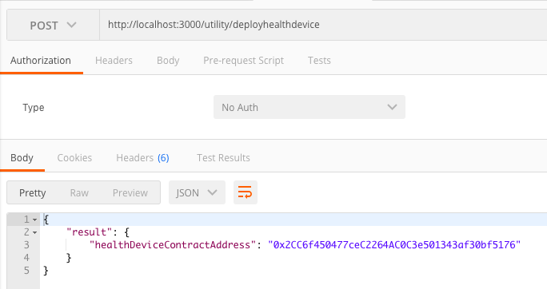
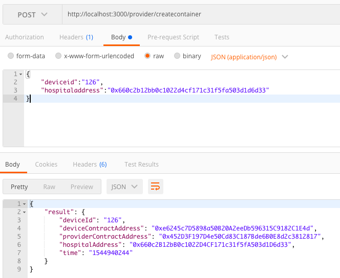
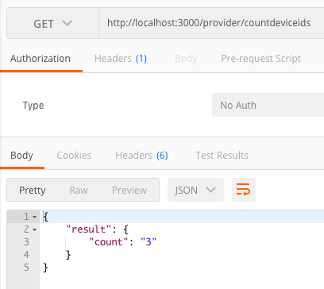
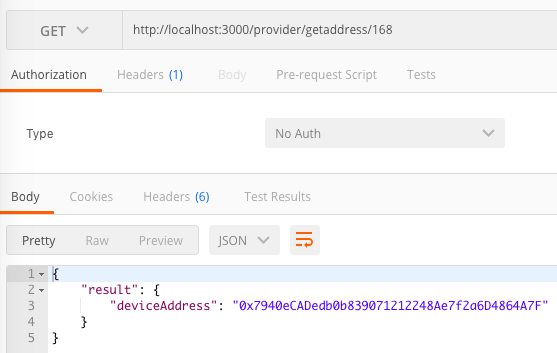
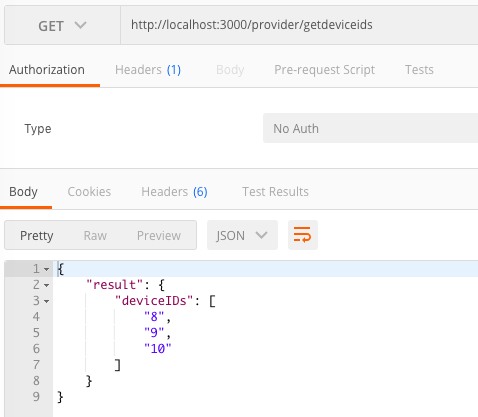
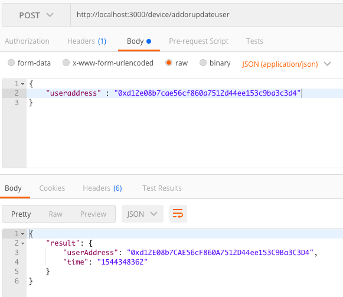
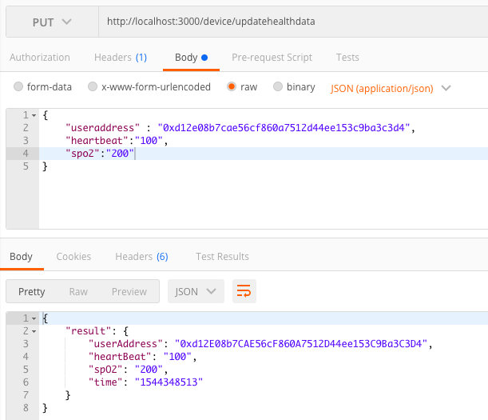
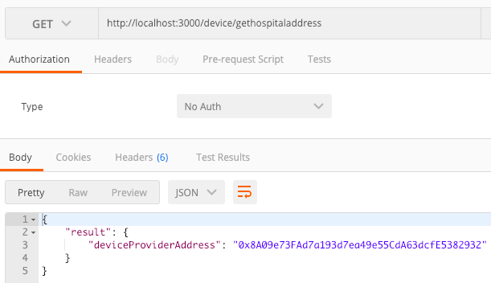

1.install postman => 測試 api 功能
2.models folder => 將智能合約的 function 規劃一個 function 一個 js 檔案
3.controllers folder => 將 models 的 function 整合成一個 class
4.routes folder => 指定 api 路徑要使用哪一個 function

## deploy

http://localhost:3000/utility/deploydeviceprovider

http://localhost:3000/utility/deployhealthdevice

## provider

http://localhost:3000/provider/createcontainer =>  創建設備

http://localhost:3000/provider/countdeviceids => 設備總數量

http://localhost:3000/provider/getaddress/8 => 查詢某設備的 address

http://localhost:3000/provider/getdeviceids => 得到所有設備 ID

## device

http://localhost:3000/device/addorupdateuser => 設定 user

http://localhost:3000/device/updatehealthdata => 上傳健康資料

http://localhost:3000/device/gethospitaladdress =>  該設備的醫療機構

http://localhost:3000/device/getuseraddress => user address

