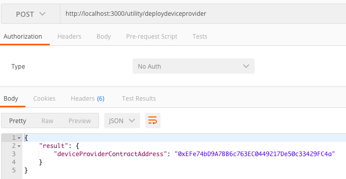
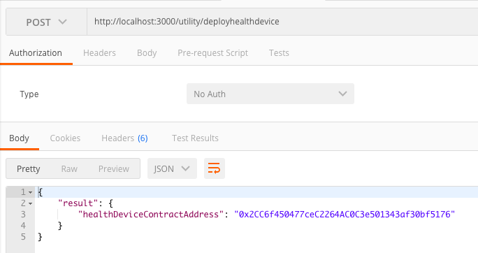
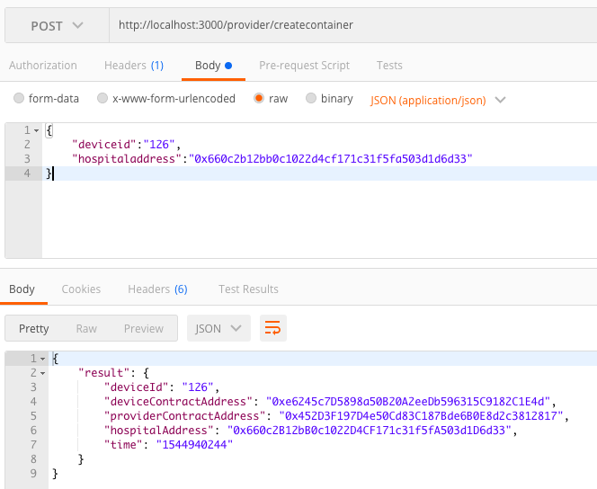
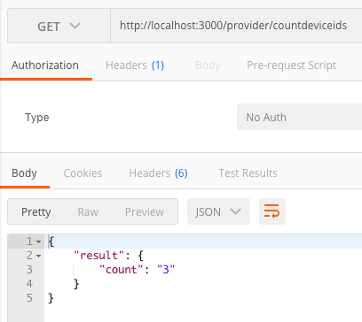
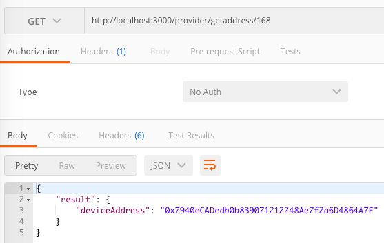
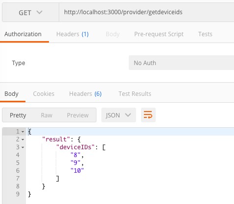
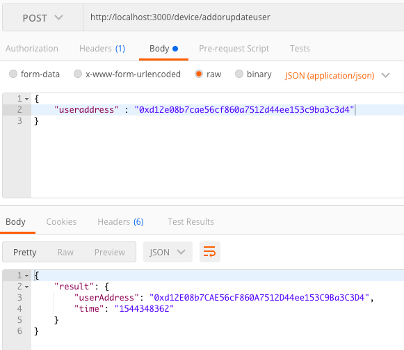
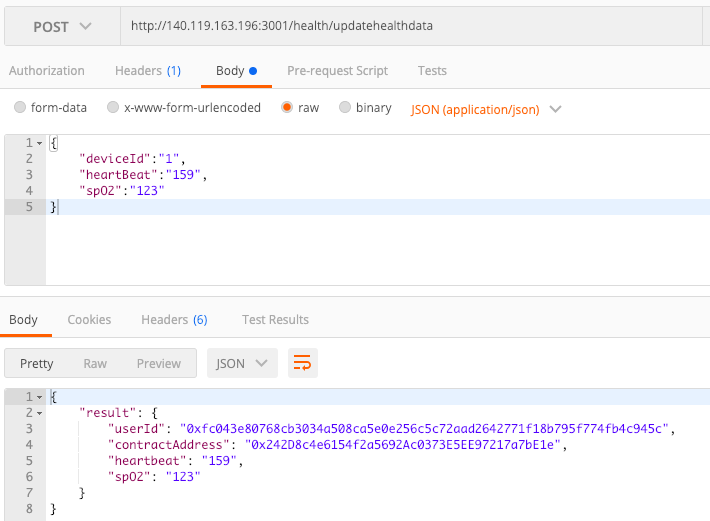
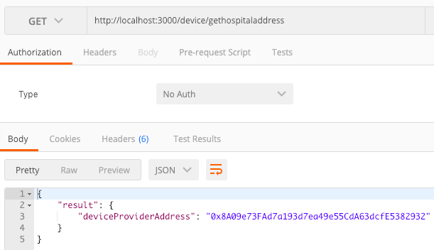

 網頁前端三個功能
1.創建設備合約- 當物聯網公司提供給醫療機構設備時，創建智能合約，並設定該醫療機構有使用權限．
2.設定使用者-醫療機構將該設備設定使用者（病患），使病患可以上傳健康資料． 3.醫療機構查看病患健康資料．

#ContractApi

## Deploy

http://localhost:3000/utility/deploydeviceprovider

http://localhost:3000/utility/deployhealthdevice

## Provider

http://localhost:3000/provider/createcontainer =>  創建設備

http://localhost:3000/provider/countdeviceids => 設備總數量

http://localhost:3000/provider/getaddress/8 => 查詢某設備的 address

http://localhost:3000/provider/getdeviceids => 得到所有設備 ID

## Device

http://localhost:3000/device/addorupdateuser => 設定 user

http://localhost:3000/device/updatehealthdata => 上傳健康資料

http://localhost:3000/device/gethospitaladdress =>  該設備的醫療機構

http://localhost:3000/device/getuseraddress => user address

#DbApi

## Server

訂閱創建設備
http://localhost:3001/server/subscribecreatecontainerevent

訂閱上傳健康資料
http://localhost:3001/server/subscribeupdatehealthdataevent

## Client

get db 智能合約位址

http://localhost:3001/client/getdevicedata

get db 該使用者的健康資料

http://localhost:3001/client/gethealthdatabyuseraccountasc/:useraccount/:devicecontractaddress

http://localhost:3001/client/gethealthdatabyuseraccountdesc/:useraccount/:devicecontractaddress
