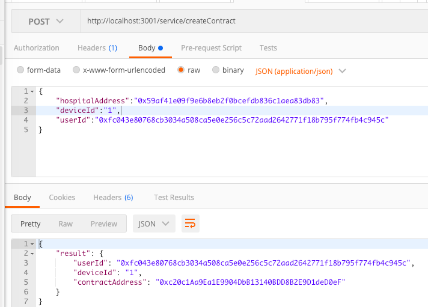

# 一、網頁前端頁面功能

## BlockChainServiceProvider

1. 增加參與者
目的：可增加醫療機構創建健康紀錄合約

## 醫療機構

1.創建健康紀錄合約 2.查看使用者的健康資料

# 二、ContractApi

## 增加參與者

http://localhost:3001/service/addParticipant

## 創建健康紀錄合約

http://localhost:3001/service/createContract

##  上傳健康資料

http://localhost:3001/health/updatehealthdata

